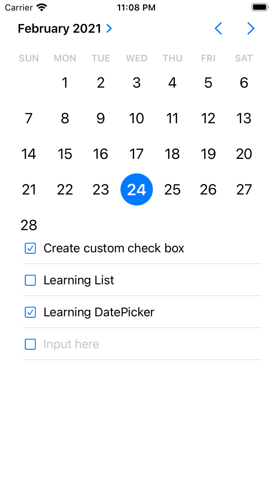

# Haruharu
> If you try to learn every day, Haruharu can be the best App.

UI mock, DataPicker and List with TextField. 
 
 
 
# Application Image

  

## Release History

* 0.1.0
    * The first proper release
    * add some functions:
        - arr on ContentView.swift
          Enables to have dynamic listed textField.
        - CheckView
          Blue check box for each list.
        - CustomTextField (not using)

## Meta

Tomoharu - [https://github.com/Toxumuharu](https://github.com/Toxumuharu)
